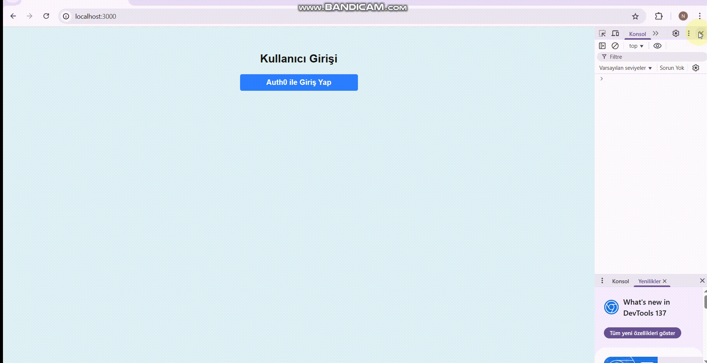

# 🛡️ Next-Auth-Application

HTML • CSS • Tailwind CSS • JavaScript • TypeScript • Next.js App Router • Auth0 • NextAuth.js • Docker

---

🔗 **Docker Hub:**  
[➡️ narutosipuden/next-auth-app](https://hub.docker.com/r/narutosipuden/next-auth-app)

---

## 👤 Example Login Credentials

### 🧑‍💻 Users

| Role  | Email               | Password        |
| ----- | ------------------- | --------------- |
| User  | `deneme@deneme.com` | `deneme1230..,` |
| User  | `test@test.com`     | `Test1230..,`   |
| Admin | `admin@admin.com`   | `dadmin1230..,` |

> Note: These accounts are created via the Auth0 dashboard, and the `roles` claim is included in the ID token.

---

## 🚀 Running with Docker

```bash
# Build the Docker image
docker build -t next-auth-app .

# Run the container
docker run -p 3000:3000 next-auth-app
```


